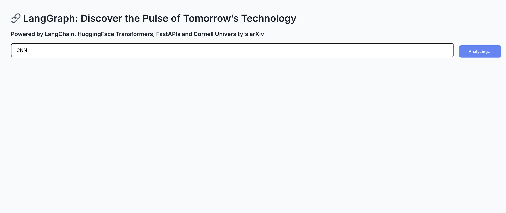
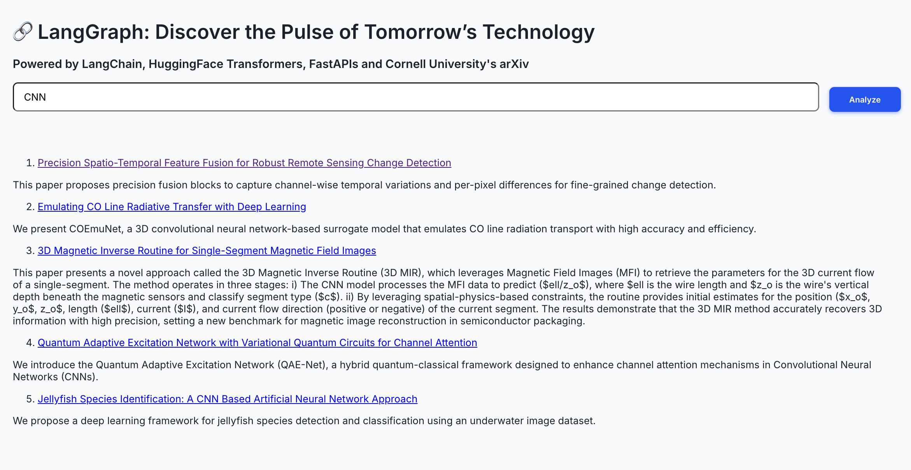
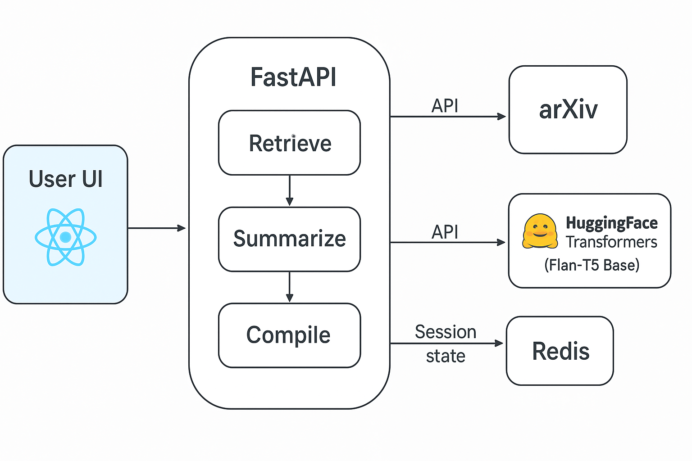

# lang-graph

## Academic Research Trends in CS/EE/DS: Agentic AI Workflow with LangGraph and FastAPI

---

### Overview

**lang-graph** is an advanced AI-driven pipeline designed for dynamic extraction, synthesis, and analysis of cutting-edge academic preprints from arXiv.org. It showcases sophisticated **agentic AI workflows** orchestrated through a graph-based engine (**LangGraph**), enabling modular, extensible, and scalable multi-agent collaboration. The backend API, built with **FastAPI**, delivers high-performance, asynchronous REST endpoints tailored for integration with modern frontend and data pipelines.

This project highlights expertise in:

- Architecting distributed, agent-driven systems with complex dependency graphs.
- Leveraging transformer-based NLP models for abstractive summarization.
- Implementing session persistence and state management via Redis for robust multi-turn conversational workflows.
- Designing clean API interfaces with asynchronous Python programming patterns.
- Applying software engineering best practices for maintainability, modularity, and cloud readiness.

---

## Demo Screenshots

#### Search Interface

Efficiently accepts user queries, performs intelligent retrieval, and supports real-time interaction.



#### Results Display

Presents summarized, structured, and actionable information with embedded links for quick exploration.



---

## Core Features

- **ArXiv Query Module**: Implements domain-specific search with customizable filtering and pagination over the arXiv API using **feedparser**.
- **Multi-Agent Workflow Execution**: Sequential and conditional orchestration of agents via **LangGraph**, enabling complex reasoning pipelines without rigid control flow.
- **Abstractive Summarization**: Integrates Hugging Face’s `google/flan-t5-base` transformer model fine-tuned for academic text to generate concise, 3-sentence summaries.
- **Stateful Session Management**: Uses **Redis** as a fast, in-memory data store to maintain user context and session state for multi-turn dialogue or iterative queries.
- **Extensible API Endpoints**: Asynchronous RESTful endpoints using **FastAPI** supporting JSON payloads and markdown-compatible outputs for easy UI rendering and downstream consumption.
- **Configurable LLM Backend**: Switchable between local Hugging Face models and OpenAI GPT APIs via environment configuration to optimize for cost, latency, or model capabilities.

---

## Agentic AI & LangGraph Architecture

The system exemplifies **agentic AI**—a paradigm where autonomous agents communicate and cooperate through explicit execution graphs:

- **LangGraph** functions as a declarative workflow engine where agents are nodes and edges represent data/control dependencies.
- Enables **non-linear execution paths**, conditional branching, and iterative refinement without embedding business logic in procedural code.
- Supports **modularity and scalability** for future features like citation network analysis, temporal trend detection, or enhanced reasoning loops.
- Decouples data retrieval, NLP processing, and report compilation into discrete, testable components.

### Agents:

| Agent           | Responsibility                                      | Technology/Technique                                  |
|-----------------|----------------------------------------------------|-----------------------------------------------------|
| Retriever Agent | Query arXiv API, fetch and rank relevant papers    | Feedparser, async HTTP requests                      |
| Summarizer Agent| Generate abstractive summaries for each paper      | Hugging Face Transformers (flan-t5-base)            |
| Compiler Agent  | Aggregate summaries into formatted markdown report | Python string templating, markdown generation        |

Execution is managed by LangGraph, which guarantees fault tolerance and seamless task orchestration.

---

## Technical Stack

| Layer                   | Tools / Frameworks                                   |
|-------------------------|-----------------------------------------------------|
| Programming Language    | Python 3.9+                                         |
| Workflow Orchestration  | LangGraph (graph-based agent execution)             |
| NLP Model Orchestration | LangChain + Hugging Face Transformers (flan-t5-base)|
| Web Framework          | FastAPI (async, high throughput REST API)           |
| State Management       | Redis (in-memory data store for session persistence)|
| External APIs          | arXiv via Feedparser                                 |
| Deployment             | uvicorn ASGI server                                  |

---

## System Architecture Diagram

Visualizes agent interaction and workflow orchestration with LangGraph:



---

## Setup & Development

### Prerequisites

- Python 3.9 or higher
- Redis server (local or cloud instance)

### Installation Steps

```bash
# Clone repository
git clone https://github.com/yourusername/lang-graph.git
cd lang-graph

# Setup virtual environment and activate
python -m venv venv
source venv/bin/activate

# Install dependencies
pip install -r requirements.txt

#  Create a `.env` file to configure the Redis URL.

# Run Redis locally (follow Redis docs).

#  Start the FastAPI app:

    ```bash
    uvicorn main:app --reload
    ```

---

## Extensibility & Customization

- **Model Backend Switching**: Abstracted LLM interface allows plugging in different transformer models or OpenAI GPT engines with minimal code changes.
- **Workflow Expansion**: LangGraph workflows can be extended to add additional agents for citation extraction, trend forecasting, or multi-modal data analysis.
- **Frontend Integration**: The API returns markdown-compatible reports, simplifying integration with React, Vue, or static site generators.

---

## Engineering Considerations

- Adopted **asynchronous programming** with `asyncio` and FastAPI for improved scalability under concurrent requests.
- Maintained **clean separation of concerns** between data fetching, NLP processing, and API presentation layers.
- Leveraged **container-friendly** design for easy Dockerization and cloud deployment.
- Included comprehensive **logging and error handling** to ensure reliability in production environments.
- Designed with **testability** in mind; core agents and workflows have isolated unit tests.

---

## Notes

- The project prioritizes **local inference** using Hugging Face models to avoid API rate limits and reduce costs, but can be adapted to OpenAI’s API by updating configuration.
- Supports **session persistence** to enable interactive, iterative querying workflows.
- LangGraph’s flexible graph execution model exemplifies modern AI workflow engineering beyond linear pipelines.

---

## License

MIT License © Ananya Dua
